# AI 辅助开发工作方式：设计、结构与验证

## 一页结论

这套方案只做两个核心变化：

1. **AI 进入现有开发流程**：参与需求预检、Spec、Design、Tasks、测试先行、实现、审查和收口，但关键产物由开发确认，最终代码仍进入既有人工 Review。
2. **任务上下文自动结构化**：把需求边界、设计决策、任务与 AC、测试义务、执行证据和 PR 交接保存在业务仓库，作为人人、人 AI、AI AI 之间的共同上下文。

目标不是增加协作点，而是让重复工作自动执行、关键判断有明确门禁、交接不再依赖完整聊天记录或口头解释。

## 工作流总图

```mermaid
flowchart LR
    A["Install Plugin"] --> B["/workflow-init<br/>CLI READY"]
    B --> C["Requirement & Context Check"]
    C --> D["Spec"]
    D --> E["Design"]
    E --> F["Tasks + AC Test Matrix"]
    F --> G["Execution Contract"]
    G --> H["Developer Approval"]
    H --> I["RED → GREEN → REFACTOR"]
    I --> J["AI Review"]
    J --> K["Unit + UI + Device Evidence"]
    K --> L["Human Review / PR"]
    L --> M["Spec Sync + Selective Memory"]
```



流程的控制逻辑是：

- AI 先检查和生成，开发再确认，不把错误理解带入后续实现。
- Spec 的 Scenario 贯穿 Design、Tasks、Test Matrix 和 PR Evidence。
- 前端任务不能用 build 或 Markdown 检查代替 UI Test 和 Device Test。
- 只有经过代码、测试或 Review 验证且未来仍难以重新发现的事实，才进入长期 Memory。

## 三层结构

| 层 | 由谁维护 | 放什么 | 解决什么问题 |
|---|---|---|---|
| 中央工作流 | 工作流维护者 | VS Code Agent Plugin、Skills、Templates、MCP 配置、全局 `ssf` CLI | 多项目复用一套流程，普通开发不需要复制或研究内部实现 |
| 项目上下文 | 项目团队 | Copilot Instructions、项目架构与编码规则、业务 Skills、选择性 Memory | 约束 AI 按项目分层、公共能力和运行时事实实现 |
| 任务上下文 | 当前需求开发者 | proposal、spec、design、tasks、execution contract、PR evidence | 明确需求边界、产物边界、测试边界和交接状态 |

业务代码、任务文档和项目规则留在业务仓库；中央 Agent、Skills、scripts 和 templates 不复制到每个仓库。

## 协作方式

| 协作关系 | 共同读取的内容 | 直接收益 |
|---|---|---|
| 人与人 | Spec、Design、Tasks、PR Evidence、风险 | Reviewer 不必从 diff 反推需求；接手者能知道完成到哪里 |
| 人与 AI | 项目规则、当前任务契约、测试结果 | 新对话不必重新描述全部背景；AI 不依赖当前聊天“显得聪明” |
| AI 与 AI | 同一执行契约、AC Test Matrix、Review Package、项目 Memory | 开发 Agent 和 Review Agent 使用同一事实基线，避免自我确认 |

不保存完整 AI 对话、冗长失败日志和无复用价值的探索过程。保存标准是：新的开发者或空白上下文 AI 只读最终产物，能否继续开发、Review 或定位风险。

## 普通需求如何落地

普通需求以 `changes/<change-name>/` 为任务边界：

```text
changes/empty-state-refresh/
  proposal.md
  specs/photo-results/spec.md
  design.md
  tasks.md
  execution-contract.md
  pr-summary.md
  decision-point-audit.md
```

结构关系不是平铺：

- `spec.md` 定义 Requirement 和 Scenario。
- `design.md` 说明每个 Scenario 由哪个设计决策实现。
- `tasks.md` 在 Batch 下按 AC 列出文件职责、具体改动和准确测试用例。
- `execution-contract.md` 冻结范围、架构约束和 AC Test Matrix。
- `pr-summary.md` 为矩阵中的每个用例提供实际命令和证据。

这使需求边界、代码改动边界和验收边界同时可见。不同需求只要各自拥有清晰任务目录、接口边界和测试证据，就不需要通过频繁口头同步保持一致；真正涉及公共接口或共同文件时，再通过 Design 和 Review 显式协作。

## Android 到鸿蒙迁移

迁移任务使用同一 SDD 骨架，但 Spec 和 Skills 增加跨端映射：

1. 对单个页面拆解 Android 行为、UI、接口、状态和交互。
2. 生成迁移 dossier 和 gate。
3. 优先迁移 Android 测试，先取得失败证据。
4. 按 dossier 小步实现、编译和测试。
5. 使用独立 Review Agent 检查遗漏、重复实现、公共能力复用和项目规范。

现有项目已完成 6 个页面的业务迁移，接口请求、页面渲染和交互逻辑一致，UI 效果接近 Android，Android 侧测试已迁移。此前未完成项是完整 Code Review 和鸿蒙 UI Test；这些不能用“功能看起来一致”替代，必须作为独立门禁记录。

## Skill 如何维护

普通同事直接使用稳定 Skill；维护者处理失败案例、规则修改和 Eval。Skill 不自动从每次聊天升级：

```text
真实失败或重复问题
  → 提出 Skill 变更
  → 增加或更新 Eval
  → 在空白上下文和代表性仓库运行
  → 对比通过率与副作用
  → 通过后进入中央 Plugin
```

当前上下文变长只说明 AI 获得了更多临时信息，不等于 Skill 已进化。没有 Eval 和空白上下文复现，就不能判断沉淀的是稳定经验还是当前任务噪声。

## 已有证据

| 主线 | 当前证据 | 状态 |
|---|---|---|
| 离线包与 CLI 安装原语 | 最终 tgz 完整性、断网本地安装、`0.13.0` 升级、重复本地安装 | 本地 PASS |
| VS Code `/workflow-init` | 命令发现、缺失 CLI 安装、升级、READY 和二次调用 | Pending VS Code runtime |
| 正式 Plugin MCP | 默认 `.mcp.json` 为空；fixture 仅验证协议和路径 | Not Configured |
| 普通需求 SDD | Android 空状态需求：完整规划、真实 Unit/UI RED、3 个 Unit、3 个 Compose UI、lint、API 29 设备执行、审查与 closing | 本地 PASS |
| Android 到鸿蒙 | 6 页面、功能一致、UI 接近、Android 测试迁移 | 项目阶段证据；完整 Code Review 和鸿蒙 UI Test 需单独给出最终结果 |

证据索引见 `validation/evidence/`。结论只按实际命令、报告和可追溯产物给出，不用计划或口头判断替代。
